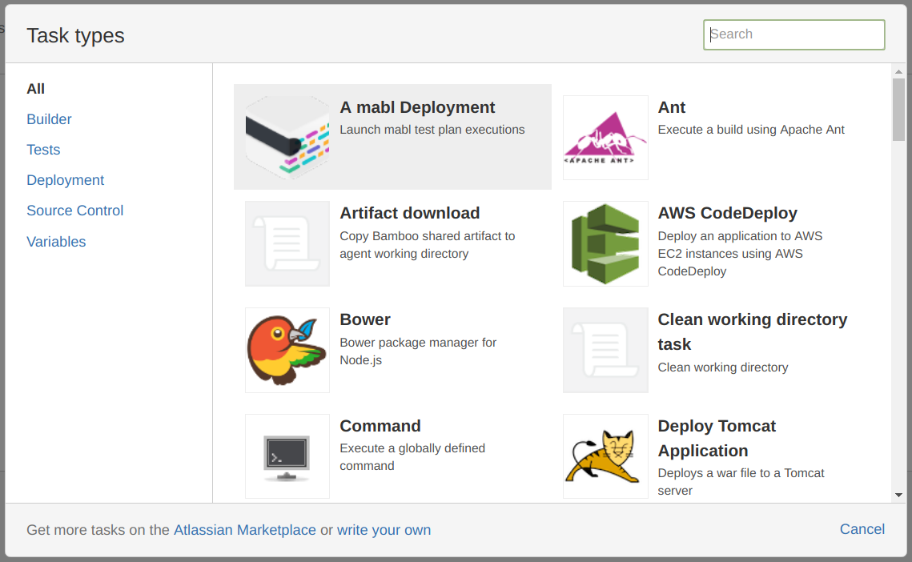
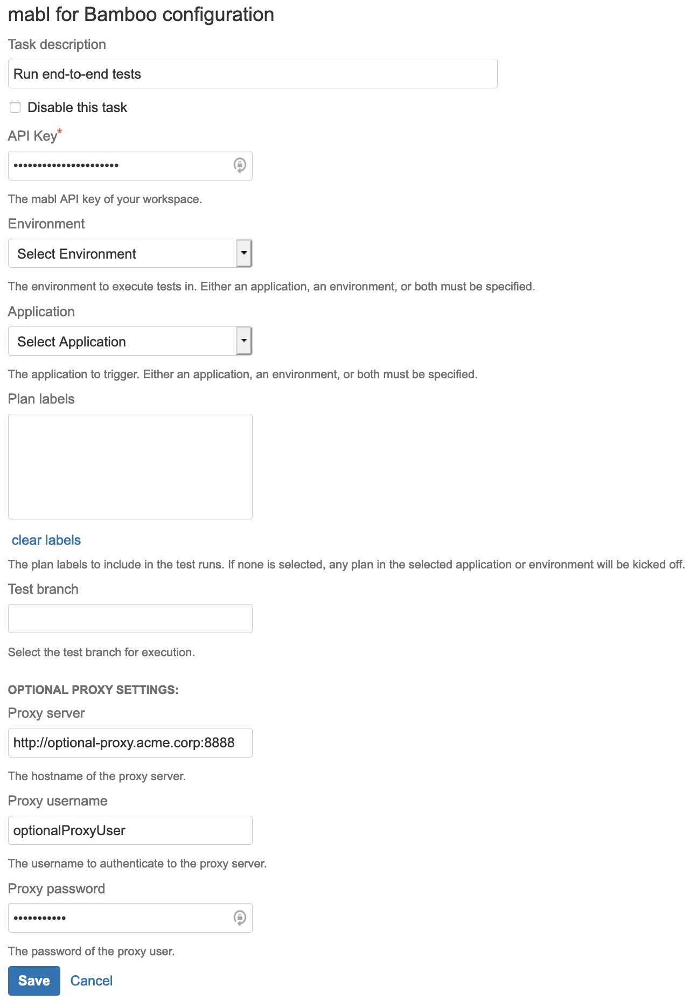

# mabl Bamboo Plugin


This plugin facilitates launching of [mabl](https://www.mabl.com) tests as a step in your Bamboo build. Your Bamboo build success or failure will be dependant on the success or failure of your mabl test deployment event.

## Using

1. Within Bamboo, from any plan's `Configure tasks` page, add a new task
   1. If you do not have a project and plan, set one up first under the Projects menu.
2. Select `A Mabl Deployment` task
  
3. Input the ApiKey and unselect the field, this will populate the Environment and Application drop-downs
  
4. Select at least 1 environment or application to proceed
5. Hit Save
6. Enable the task and the plan

Now builds from this plan will trigger Mabl test plan executions of the chosen configuration.
If executions are scheduled successfully, then the plugin will set the `mabl.deployment.id` variable to correspond
to the deployment event ID in mabl.

### Proxy Settings

#### Global proxy settings

If you have a proxy enabled for your bamboo installation, this plugin respects outbound proxy settings you have configured for your server as described in [Atlassian's instructions.](https://confluence.atlassian.com/kb/how-to-configure-outbound-http-and-https-proxy-for-your-atlassian-application-834000120.html)

#### Plugin specific proxy settings

For installations that require only the plugin's requests be sent through a proxy or through a different proxy server than the bamboo installations default proxy, you can configure the settings within the deployment task configuration. Basic authentication is supported if the proxy server requires credentials to handle the requests. 

#### Traffic routing

Note that once you configure a proxy either on a global level or inside the _mabl for Bamboo_ task, the plugin will
send all HTTP calls through the proxy. For example, this includes calls made to retrieve the list of environments when
configuring the task.

## Installation

### From the marketplace

See the [Atlassian Docs](https://marketplace.atlassian.com/apps/1219102/mabl-deployment?hosting=server&tab=installation) about installing from the marketplace.

### Building from source and running locally

NOTE: You need to run on Java 8 with a version less than 255 (i.e. `1.8.0_345` will not work). Otherwise, you will run into  [this issue](https://confluence.atlassian.com/bamkb/bamboo-fails-to-configure-embedded-database-in-environments-with-java-update-version-higher-than-255-1018269728.html).

Install the [Atlassian SDK](https://developer.atlassian.com/server/framework/atlassian-sdk/set-up-the-atlassian-plugin-sdk-and-build-a-project/)

1. Clone this repo && cd into it
2. Build this repo by running `atlas-mvn package`
3. `atlas-run` and visit the provided url

  ```text
  [INFO] bamboo started successfully in 119s at http://$USER:6990/bamboo
  [INFO] Type Ctrl-D to shutdown gracefully
  [INFO] Type Ctrl-C to exit
  ```

### Building from source and running in docker container

Grab [this container](https://hub.docker.com/r/atlassian/bamboo-server/)
`docker pull atlassian/bamboo-server`
Run these commands

```bash
docker volume create --name bambooVolume
docker run -v bambooVolume:/var/atlassian/application-data/bamboo --name="bamboo" --init -d -p 54663:54663 -p 8085:8085 atlassian/bamboo-server
docker start bamboo
```

If you are running on an M1 Mac, then you'll need an additional `--platform linux/amd64` flag on the `docker run` command.
```bash
docker volume create --name bambooVolume
docker run --platform linux/amd64 -v bambooVolume:/var/atlassian/application-data/bamboo --name="bamboo" --init -d -p 54663:54663 -p 8085:8085 atlassian/bamboo-server
docker start bamboo
```

You will need to create a Bamboo trial license [here](https://my.atlassian.com/license/evaluation), which you will provide the server below.

Visit `localhost:8085` to interact with Bamboo.

### IDE setup

You'll need to [follow here](https://community.developer.atlassian.com/t/configure-idea-to-use-the-sdk/10610) to setup your IDE to use atlas-mvn

### Testing

You'll want to test this in the context of `atlas-run` and in a container as the way urls are built are different between the two.
To login as an admin during testing, you can use the username "admin" and password "admin".

### Manual Deployment

1. Create a new branch for releasing the plugin.
2. Remove `-SNAPSHOT` from the plugin version and update the `<scm>` `<tag>` version to `bamboo-plugin-{currentVersion}` in the pom.xml file. `currentVersion` should be in the form `0.1.12`.
3. Commit and push changes (preferably with a commit message like `[maven-release-plugin] prepare release bamboo-plugin-{currentVersion}`).
4. Open branch for PR review and wait for approvals. Once ready to merge, perform the following steps.
5. Run `atlas-mvn clean install`.
6. Upload the resulting `target/bamboo-plugin-$VERSION.jar` to the [Atlassian marketplace](https://marketplace.atlassian.com/manage/apps/1219102/versions).
   Make sure your version doesn't include `-SNAPSHOT` if you're uploading manually since that is the development build.
   Uploading will require an admin to the mablhq Atlassian vendor account.
    1. To manually upload a new version to the [Atlassian marketplace](https://marketplace.atlassian.com/manage/apps/1219102/versions),
       Click on `Create version` button and upload the jar file. You will also need to set a unique build number for the release.
    2. Most of the default options will be pre-filled, but change them if they are no longer applicable.
    3. For the `compatible to` field, choose the latest version of Bamboo.
7. Tag the current commit with `git tag -a -m "[maven-release-plugin] bamboo-plugin-{currentVersion}" bamboo-plugin-{currentVersion}` and push the tag by running `git push origin bamboo-plugin-{currentVersion}`.
8. Update the plugin version to `{nextVersion}-SNAPSHOT`, where `nextVersion` should be in the form `0.1.13`.
   Commit and push changes (preferably with a commit message like `[maven-release-plugin] prepare for next development iteration`).
9. Merge the branch. Alternatively, merge the branch after step 4, and open a new branch for step 8.

### Deployment (does not work with the current pom.xml file)

1. Merge code into default branch and push
2. Run `atlas-mvn clean install`
3. Run `atlas-release` This will update pom.xml with new version and tag the release with current version minus `-SNAPSHOT`, before putting that back together with the latest version.
